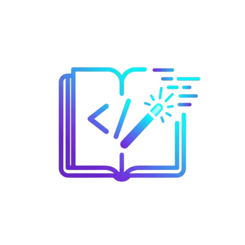
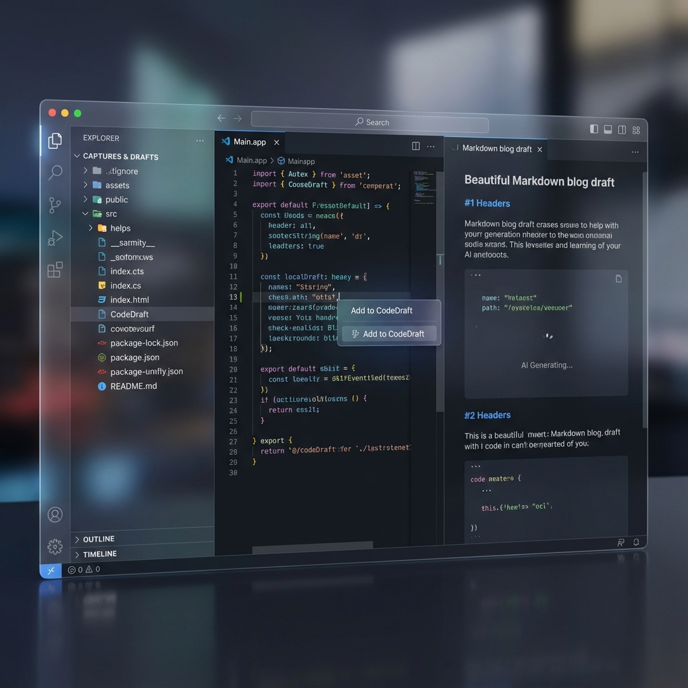

  

# CodeDraft 📝

**Turn your code learnings into blog drafts — automatically.**

CodeDraft is a Visual Studio Code (VS Code) extension designed for software engineers who struggle to maintain a consistent technical writing habit. By integrating directly into the developer's primary workflow (coding and Git), CodeDraft captures insights "in-flow," aggregates them intelligently, and generates ready-to-publish drafts.

> [!IMPORTANT]
> **Unique Value Proposition:** Unlike existing blogging extensions, CodeDraft is *proactive*. It captures learnings from code selections and commits automatically, using AI to suggest and outline drafts tailored specifically for developers.

## 🚀 Key Features

- **In-Flow Capture**: Quickly save code snippets and learning notes using hotkeys or context menus.
- **Git integration**: Automatically aggregates context from your recent commits and project structure.
- **AI-Powered Drafts**: Generate outlines and full Markdown drafts using local (Ollama) or cloud-based AI providers (OpenAI, Anthropic, Grok).
- **Proactive Prompts**: Get nudged to document "interesting" changes like bug fixes or refactors.
- **Offline-First**: Keep your ideas private and work locally with Ollama.

## 🛠️ Getting Started

### 1. Installation
Install CodeDraft from the VS Code Marketplace.

### 2. Setup AI (Recommended: Ollama)
For the best experience (and privacy), we recommend using **Ollama** for local AI generation:
1. Download and install [Ollama](https://ollama.com/).
2. Run `ollama run llama3` in your terminal.
3. In VS Code settings, ensure `CodeDraft: AI Provider` is set to `ollama`.

### 3. Usage
- **Capture Snippet**: Select code, right-click and choose **CodeDraft: Capture Code Snippet** (or Use `Cmd+Shift+C`).
- **Add Note**: Run **CodeDraft: Add Learning Note** (`Cmd+Shift+L`) to jot down an insight.
- **Generate Draft**: Click the CodeDraft icon in the Activity Bar and hit **Generate Draft** (`Cmd+Shift+G`).

## ⚙️ Configuration

CodeDraft is highly configurable via VS Code Settings (`Ctrl+,`):

| Setting | Description | Default |
|---------|-------------|---------|
| `codedraft.ai.provider` | AI service (ollama, openai, anthropic, grok) | `ollama` |
| `codedraft.ai.model` | Model name (e.g., `llama3`, `gpt-4o`) | `llama3` |
| `codedraft.ai.endpoint` | API endpoint (for Ollama) | `http://localhost:11434` |
| `codedraft.capture.surroundingLines` | Lines of context captured with snippets | `10` |

## 🤝 Contributing

Contributions are welcome! Please see our [CONTRIBUTING.md](./CONTRIBUTING.md) for guidelines on how to get involved.

## 📄 License

CodeDraft is released under the [ISC License](./LICENSE).

---
Built with ❤️ by [Timadey](https://github.com/Timadey)
